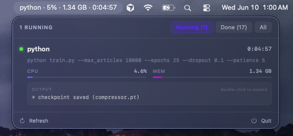
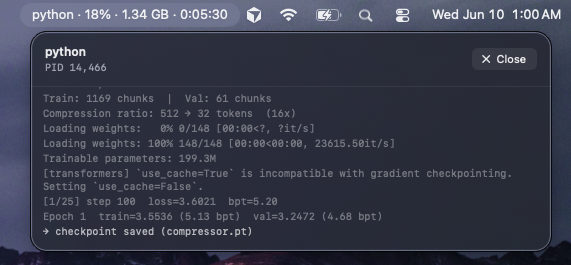

# ProcessMonitor

Ever kicked off a training run, switched to another app, and had no idea if it was still going — or had silently crashed hours ago?

ProcessMonitor puts a live status indicator in your menu bar so you always know what's running, how long it's been going, and what it last printed — without switching back to a terminal window.

 

## The problem

When you run a long job in the terminal — ML training, a build, a test suite — you lose visibility the moment you switch windows. You either:
- Keep a terminal visible at all times, taking up screen space
- Constantly switch back to check if it's still alive
- Come back later to find it silently died at epoch 3

ProcessMonitor fixes this by surfacing that info as a persistent menu bar widget.

## How it works

ProcessMonitor has two parts:

| Component | What it does |
|---|---|
| `mon` | CLI wrapper — runs any command and streams live status to `~/.process_monitor/` |
| `ProcessMonitor.app` | Native SwiftUI menu bar app — watches those files with FSEvents and shows them instantly |

`mon` launches your command through a **pseudo-terminal** so programs flush output naturally (no buffering). It writes a JSON status file every 3 seconds and streams all output to a log file. The app reacts within ~200ms using FSEvents whenever that file changes.

## Install

### 1. Install the `mon` CLI

```bash
sudo cp mon /usr/local/bin/mon
chmod +x /usr/local/bin/mon
```

### 2. Build the macOS app

Open `ProcessMonitor/ProcessMonitor.xcodeproj` in Xcode and press **⌘R**.

> **Sandbox note:** In Xcode → Signing & Capabilities, disable **App Sandbox** so the app can read from `~/.process_monitor/`.

## Usage

Prefix any long-running command with `mon`:

```bash
mon python train.py --epochs 100
mon --name "Build" make all
mon npm run build
mon pytest
```

Click the menu bar icon to open the popover. While you work in other apps, the menu bar shows the active process name, CPU %, memory, and elapsed time at a glance.

## Features

- **Menu bar title** — `python · 45% · 1.1GB · 0:12` always visible
- **Filter tabs** — Running / Done / All
- **Live stats** — CPU % and memory with animated progress bars
- **Output preview** — last 4 lines of stdout/stderr per process
- **Log overlay** — double-click any row to open a full scrollable log
- **Instant updates** — FSEvents watcher reacts in ~200ms, no polling
- **ANSI stripping** — color codes and `\r` from tqdm cleaned automatically

## Project structure

```
mon                              # CLI wrapper — copy to /usr/local/bin/
ProcessMonitor/
  ProcessMonitor.xcodeproj/
  ProcessMonitor/
    ProcessMonitorApp.swift      # App entry point + MenuBarExtra setup
    MainView.swift               # Popover UI, filter tabs, rows, log overlay
    Models.swift                 # ProcessInfo struct + computed properties
    ProcessStore.swift           # FSEvents watcher, ANSI strip
    Assets.xcassets/
```

## Requirements

- macOS 14+ (Sonoma)
- Python 3 — for the `mon` CLI
- Xcode 16+ — to build the app
